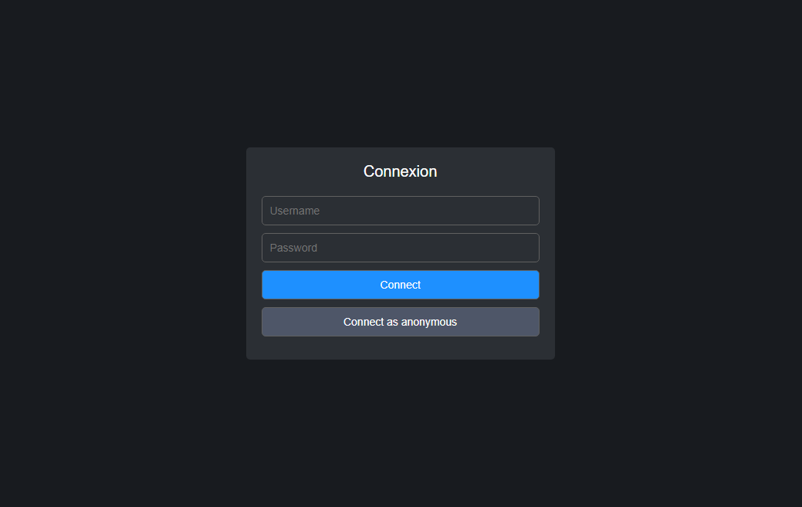
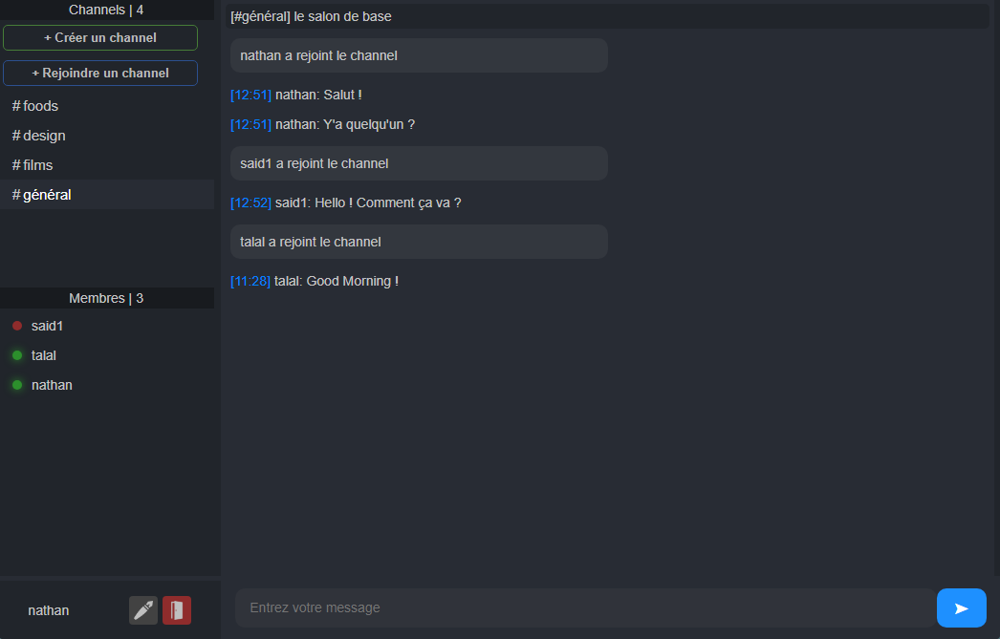
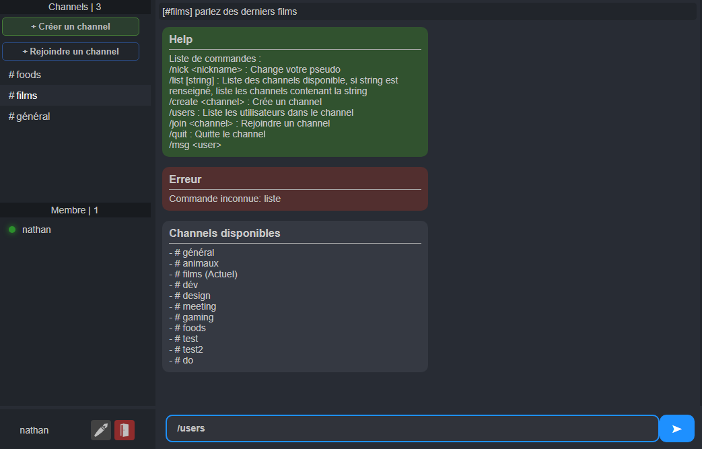
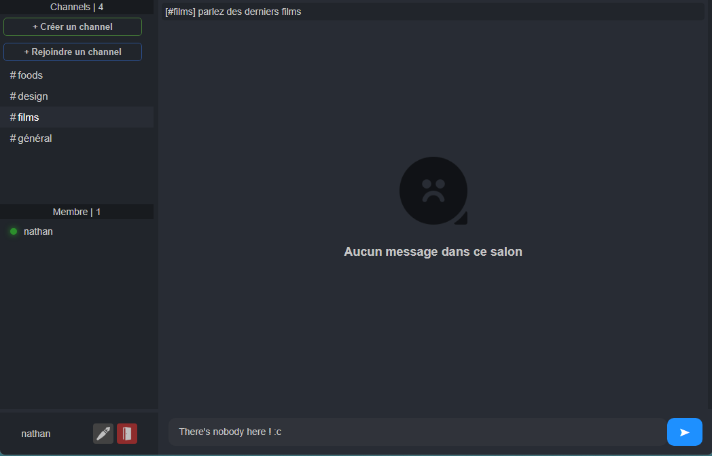

# Epitech-Online-Chat (T-JSF-600-TLS_6) (WIP)

## Licence

⚠️This repository is temporarily public and may only be used for reference purposes. Any unauthorized use or redistribution is strictly prohibited until further notice. Please respect copyrights.⚠️

## Introduction 📖
The aim of this project is to create an online chat service based on the old IRC (Internet Relay Chat Protocol) clients.
But using a much more popular protocol today: TCP.
So we've taken up the concept of channels, members and system messages, ....
A sort of discord, but with our own twist.











## Technologies 💯

MERN Stacks
- Front-end : **[ReactJS + Vite](https://fr.react.dev/)**
- Back-end : **[ExpressJS + Mongoose](https://expressjs.com/fr/)**
- Database : **[MongoDB + MongoDB Compass](https://www.mongodb.com/fr-fr)**

## Steps to install 📝
⚠️ **Dependencies** ⚠️<br>
Make sure you have a version of node >= 16 and npm >= 7, you can check it with : 
```bash
node -v
```
```bash
npm -v
```

Then, go to the **Frontend/irc** folder and run the following command : 
```bash
npm install
```

Then, go to the **Backend/src** folder and run the same command.

## How to use 🚀
- **Create a .env file :**

In the **Backend/src** folder, create a .env file and add the following lines : 
```bash
DB_URL=mongodb+srv://<username>:<password>@<clusterdomain>/<dbname>?retryWrites=true&w=majority
```

- **Run servers :**

Here, you can run the front end dev server with the following command : 
```bash
npm run dev
``` 

And the back end server with the following command : 
```bash
nodemon index.js
```

## Features in progress

- [x] Password encryption 
- [x] User registration
- [x] Better anonymous user management
- [x] Private messages
- Better UI Implementation (replace commands by buttons)
- File sharing


## Contributors 💪 
**- Nathan DULAC** <br>
- [Github](https://github.com/Torahime3)
- [Linkedin](https://www.linkedin.com/in/nathan-dulac-2aa654257/)<br>

**- Talal BOUNAAMA** <br>
- [Github](https://github.com/TalalBoni)
- [Linkedin](https://www.linkedin.com/in/talal-bounaama/)<br>

**- Saïd SOUIDI** <br>
- [Github](https://github.com/VagabondSEC)
- [Linkedin](https://www.linkedin.com/in/saïd-souidi-560253240/)<br>

